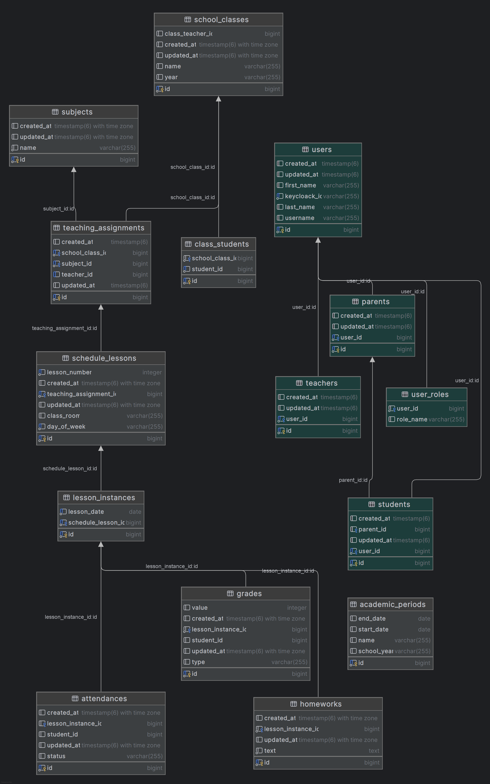

# Школьный дневник

# ⚠️!Еще не закончено!⚠️

## Микросервисное приложение школьный дневник 

### Стек:
- Spring Cloud (Eureka, Api Gateway), Jpa (psql), Spring security (Oauth resource server), Flyway, Простые логи (пока что) Logback Loki Alloy, 
- Psql, Keycloack, RabitMQ(планируется)
- Фронт планируется на React + Redux 

### Структура бд
