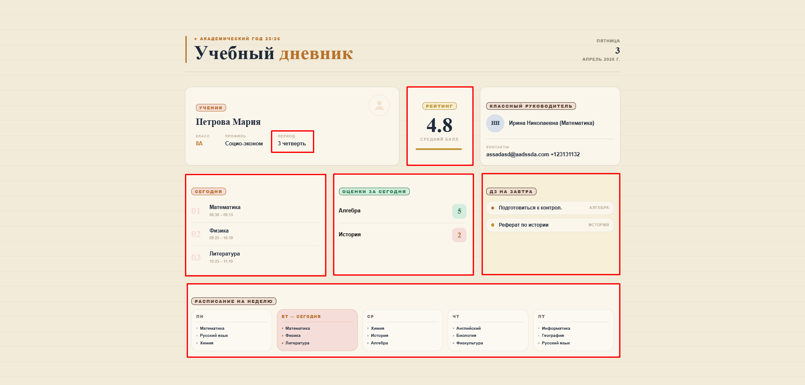

# Школьный дневник

# ⚠️!В процессе!⚠️

## Микросервисное приложение школьный дневник

### Стек:
- Backend
  - Spring Cloud (Eureka, Api Gateway)
  - Jpa (psql)
  - Spring security (Oauth resource server - Keycloak)
  - Keycloak
  - Psql
  - Flyway
  - Минимально настроены логи: Logback Loki Alloy
  - RabitMQ (планируется)
- Frontend
  - React
  - Redux Tookit
  - Vite
  - keycloak-js
  - react-dom
  - shadcn-ui
  - react-router-dom
  - tailwindcss

### Структура бд

### Макеты фронта
#### красная рамка - заглушки

