# Школьный дневник

Микросервисная платформа для управления школой — расписание, оценки, посещаемость, дз, классы


## Статус проекта

Проект в разработке, процент закрытых issue до mvp


### [Mvp milestone](https://github.com/M8eight/dnevnik/milestone/1)


## Технологический стек

Backend:

- Spring Boot, Spring Cloud Gateway, Eureka Discovery, OpenFeign
- Spring Data JPA, PostgreSQL
- Flyway
- Spring Security OAuth2 Resource Server, Keycloak
- MapStruct
- Logback, Loki, Grafana Alloy, Grafana
- JUnit, Mockito, MockMvc

Frontend:

- Vite, React
- React Router
- TanStack Query
- Redux Toolkit
- Axios
- Tailwind CSS, shadcn/ui, Radix UI, lucide-react
- react-hook-form, Zod
- keycloak-js

## Высокоуровневая архитектура

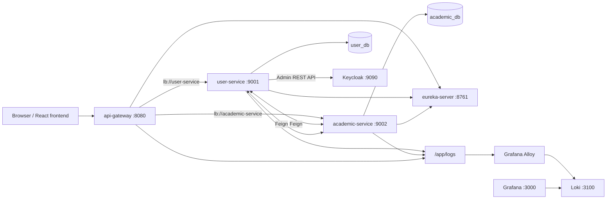
```mermaid
flowchart LR
    Browser["Browser / React frontend"] --> Gateway["api-gateway :8080"]

    Gateway -->|lb://user-service| UserService["user-service :9001"]
    Gateway -->|lb://academic-service| AcademicService["academic-service :9002"]

    UserService --> UserDb[("user_db")]
    AcademicService --> AcademicDb[("academic_db")]

    UserService -->|Admin REST API| Keycloak["Keycloak :9090"]
    UserService <-->|Feign| AcademicService
    AcademicService <-->|Feign| UserService

    Gateway --> Eureka["eureka-server :8761"]
    UserService --> Eureka
    AcademicService --> Eureka

    UserService --> Logs["/app/logs"]
    AcademicService --> Logs
    Gateway --> Logs
    Logs --> Alloy["Grafana Alloy"]
    Alloy --> Loki["Loki :3100"]
    Grafana["Grafana :3000"] --> Loki
```

## Сервисы

| Сервис | Порт | Назначение | Основные файлы |
| --- | ---: | --- | --- |
| `api-gateway` | `8080` | Единая точка входа, маршрутизация, Swagger aggregation | `backend/api-gateway/src/main/resources/application.yml`, `GatewayConfig.java` |
| `eureka-server` | `8761` | Service discovery (обнаружение сервисов) | `backend/eureka-server/src/main/resources/application.yml` |
| `user-service` | `9001` | Пользователи, роли, профили учеников/учителей/родителей, Keycloak admin API | `backend/user-service/src/main/java/com/rusobr/user` |
| `academic-service` | `9002` | Учебные годы, периоды, классы, предметы, расписание, уроки, оценки, посещаемость, ДЗ | `backend/academic-service/src/main/java/com/rusobr/academic` |
| `frontend` | `5173` в Docker, Vite dev port локально | Внешний интерфейс школьной системы | `frontend/src` |

## Структура проекта

```text
.
├── backend/
│   ├── academic-service/
│   │   ├── src/main/java/com/rusobr/academic/
│   │   │   ├── application/        # services, mappers
│   │   │   ├── config/             # security
│   │   │   ├── domain/             # entities, enums
│   │   │   ├── infrastructure/     # Feign clients, repositories, projections
│   │   │   └── web/                # controllers, DTO, exceptions
│   │   └── src/main/resources/db/migration/
│   ├── user-service/
│   │   ├── src/main/java/com/rusobr/user/
│   │   │   ├── application/        # services, user role strategies, mappers
│   │   │   ├── config/             # security, web client, Feign error decoder
│   │   │   ├── domain/             # User, Student, Teacher, Parent
│   │   │   ├── infrastructure/     # Feign, Keycloak WebClient, repositories
│   │   │   └── web/                # controllers, DTO, exceptions
│   │   └── src/main/resources/db/migration/
│   ├── api-gateway/
│   ├── eureka-server/
│   └── settings.gradle
├── frontend/
│   ├── src/
│   │   ├── axios/                  # shared Axios client
│   │   ├── components/             # ui, admin, student, teacher, layout
│   │   ├── hooks/                  # TanStack Query hooks
│   │   ├── services/               # API clients
│   │   ├── store/                  # Redux Toolkit
│   │   └── views/                  # route pages
│   └── package.json
├── configs/                        # Keycloak realm, Loki, Alloy, Grafana конфиги
├── docs/                           # readme files
├── init-db/                        # PostgreSQL init db`s
└── docker-compose.yml
```

## Взаимодействие сервисов

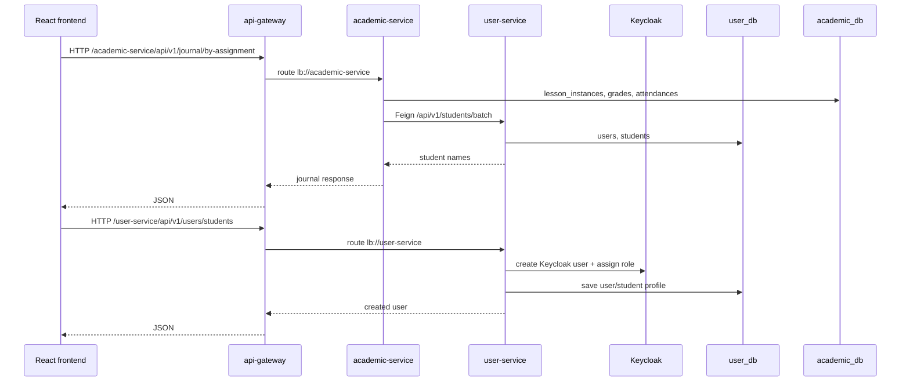
```mermaid
sequenceDiagram
    participant UI as React frontend
    participant GW as api-gateway
    participant AC as academic-service
    participant US as user-service
    participant KC as Keycloak
    participant DBU as user_db
    participant DBA as academic_db

    UI->>GW: HTTP /academic-service/api/v1/journal/by-assignment
    GW->>AC: route lb://academic-service
    AC->>DBA: lesson_instances, grades, attendances
    AC->>US: Feign /api/v1/students/batch
    US->>DBU: users, students
    US-->>AC: student names
    AC-->>GW: journal response
    GW-->>UI: JSON

    UI->>GW: HTTP /user-service/api/v1/users/students
    GW->>US: route lb://user-service
    US->>KC: create Keycloak user + assign role
    US->>DBU: save user/student profile
    US-->>GW: created user
    GW-->>UI: JSON
```

### User-service DB

Основные таблицы:

- `users`
- `user_roles`
- `students`
- `teachers`
- `parents`

Диаграмма:

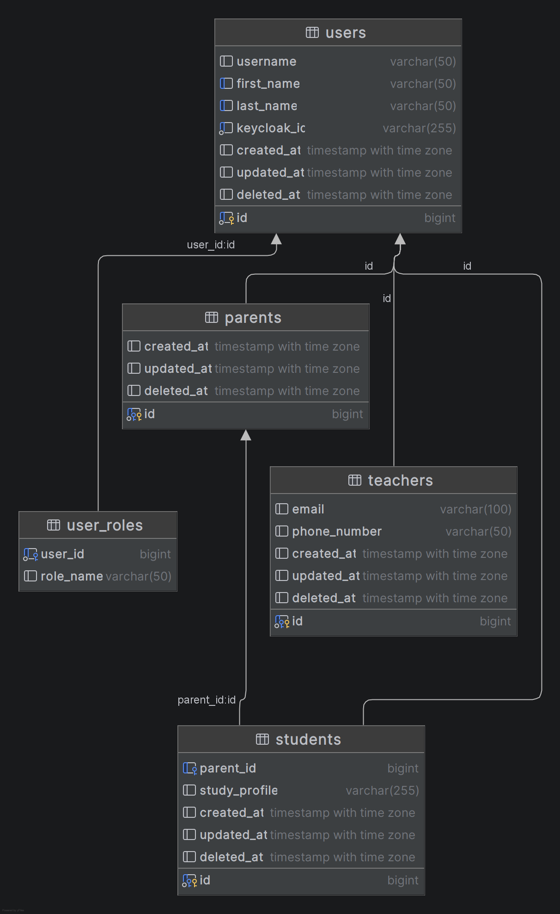

### Academic-service DB

Основные таблицы:

- `academic_years`, `academic_periods`
- `school_classes`, `class_students`
- `subjects`, `teacher_subjects`, `teaching_assignments`
- `schedule_lessons`, `lesson_instances`
- `grades`, `period_grades`, `final_grades`
- `attendances`
- `homeworks`

Диаграмма:

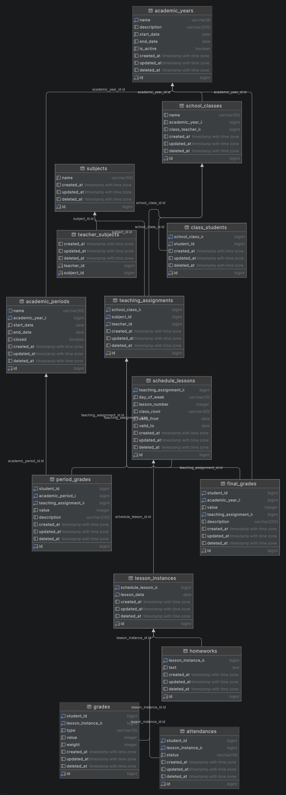

## API Gateway и Swagger

Gateway маршрутизирует запросы по префиксам:

| Prefix | Target |
| --- | --- |
| `/user-service/**` | `lb://user-service` |
| `/academic-service/**` | `lb://academic-service` |

Swagger UI:

- `http://localhost:8080/swagger-ui/index.html`

## Frontend routes

Ученик:

- `/student/home` - главная
- `/student/diary` - дневник
- `/student/grade` - оценки

Учитель:

- `/teacher/journal` - журнал успеваемости
- `/teacher/homework` - домашние задания

Администратор:

- `/admin/subject` - предметы
- `/admin/period` - учебные периоды
- `/admin/school-class` - классы
- `/admin/user` - пользователи
- `/admin/schedule` - расписание
- `/admin/academic-year` - учебные годы

Дополнительно:

- `/user/:id/info` - карточка пользователя

## Запуск через Docker Compose

```bash
docker compose up --build
```

После запуска:

- Frontend: `http://localhost:5173`
- Gateway: `http://localhost:8080`
- Swagger: `http://localhost:8080/swagger-ui/index.html`
- Eureka: `http://localhost:8761`
- Keycloak: `http://localhost:9090`
- Grafana: `http://localhost:3000`

Keycloak admin:

- login: `admin`
- password: `password`

Grafana:

- login: `admin`
- password: `admin`

## Локальный запуск без Docker

Backend:

```bash
cd backend
./gradlew :eureka-server:bootRun
./gradlew :api-gateway:bootRun
./gradlew :user-service:bootRun
./gradlew :academic-service:bootRun
```

Windows PowerShell:

```powershell
cd backend
.\gradlew.bat :eureka-server:bootRun
.\gradlew.bat :api-gateway:bootRun
.\gradlew.bat :user-service:bootRun
.\gradlew.bat :academic-service:bootRun
```

Frontend:

```bash
cd frontend
npm install
npm run dev
```
## Screenshots

### Ученик

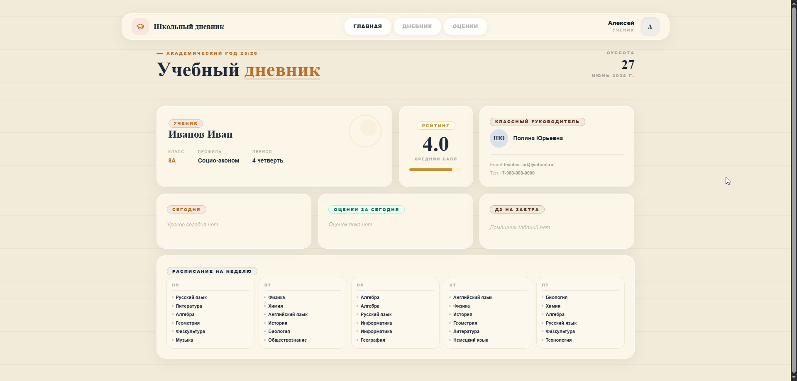
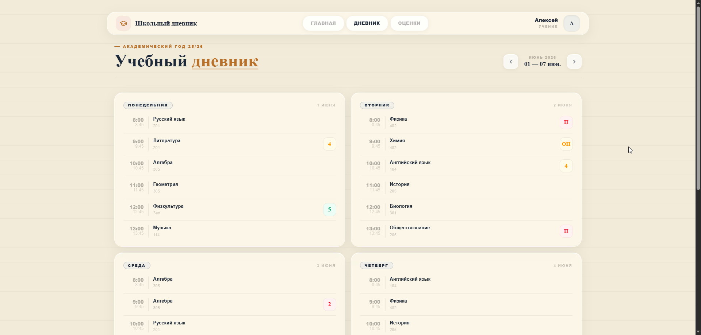
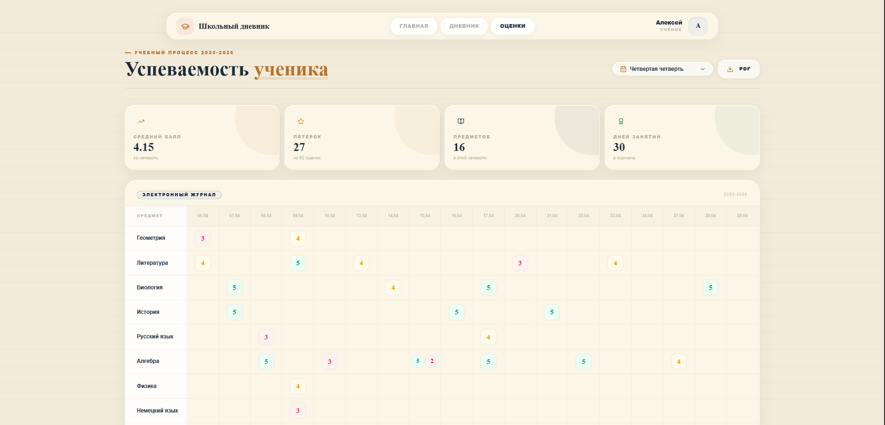
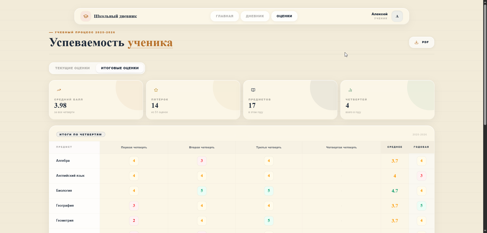

### Учитель

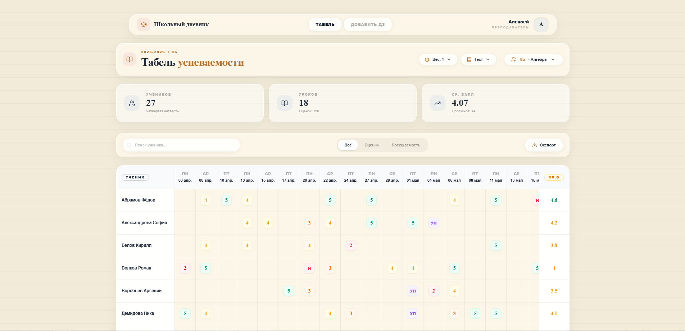
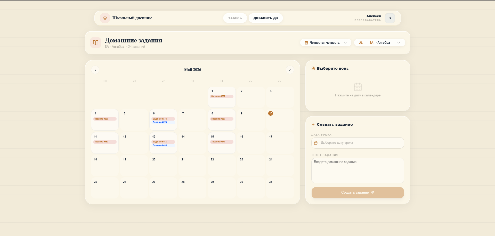
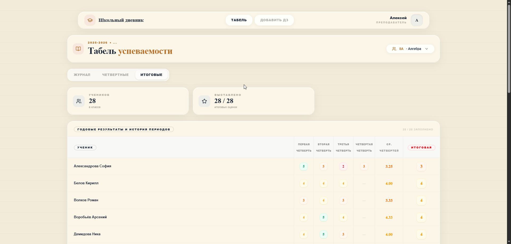
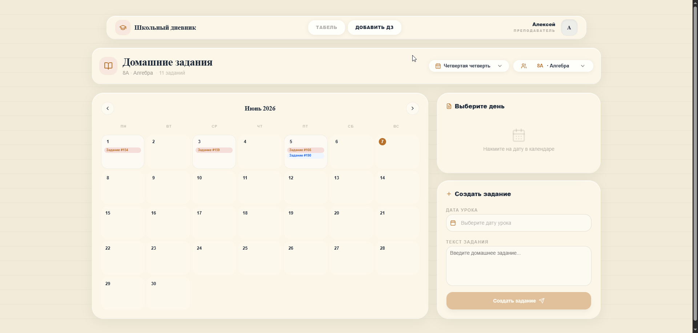

### Администратор

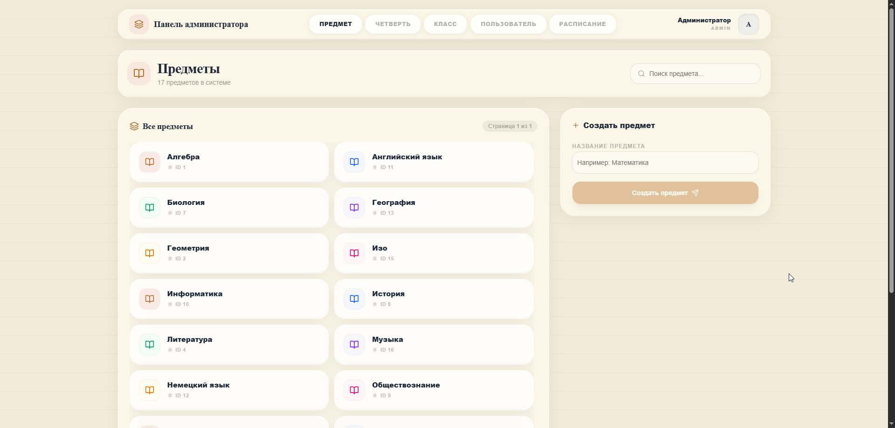
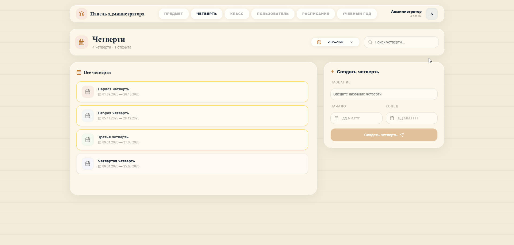
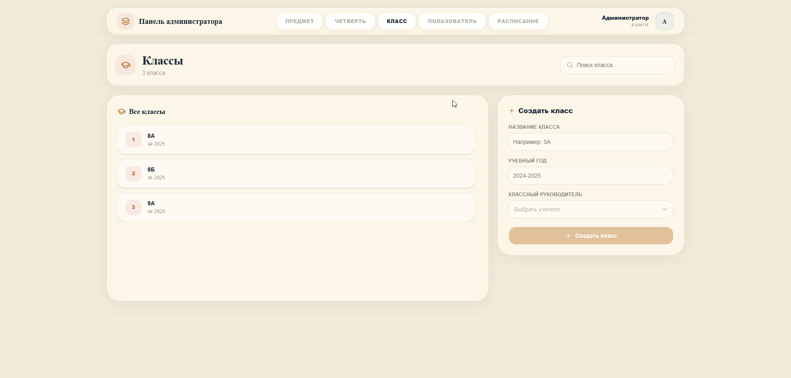
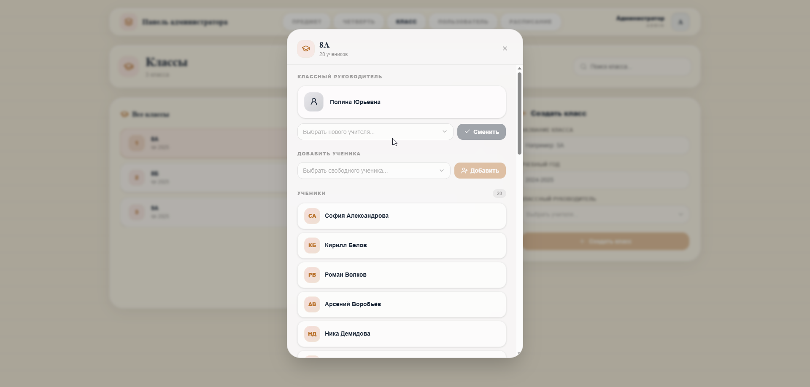
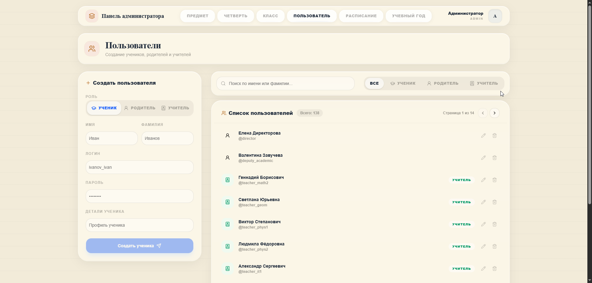
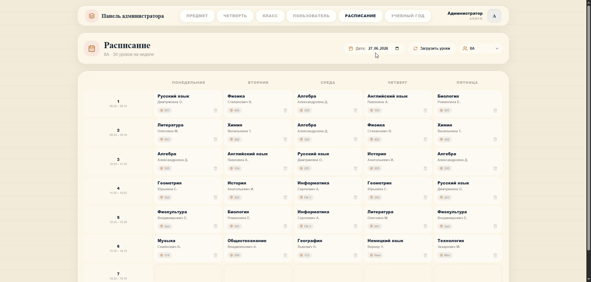
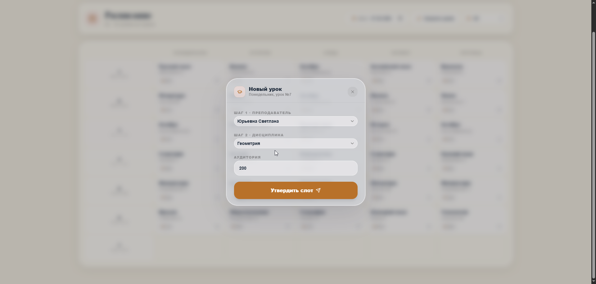
