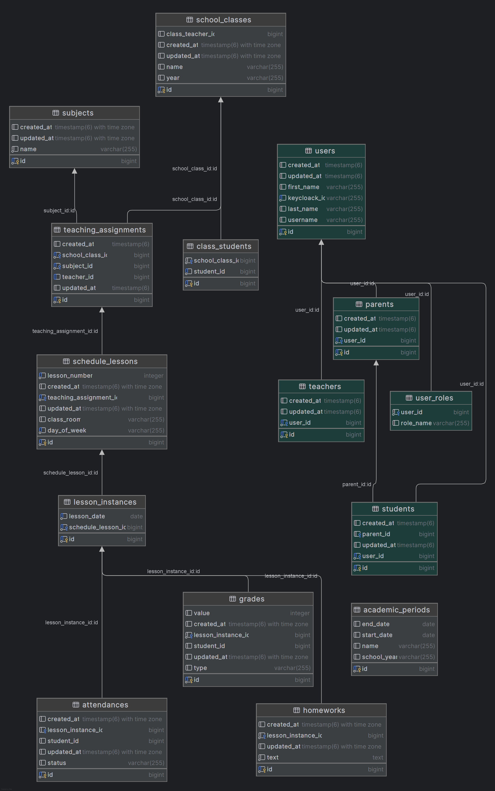

# Школьный дневник 📓

# Школьный дневник на микросервисах

## 🏗 Архитектура
Backend на Spring cloud (eureka, api gateway, feign).
* **Security:** Jwt авторизация через Keycloak (OAuth2 resource server).
* **Db:** Psql Jpa Flyway
* **Log** Логи на Loki Alloy
  Frontend будет на React + Redux

## 🚀 Стек технологий
[Здесь та самая таблица]

## 🛠 Как запустить локально
1. Запуск через Docker.
2. Поднимите инфраструктуру: `docker-compose up -d`.

## 📂 Структура БД
База данных проекта (keycloak также в psql)

